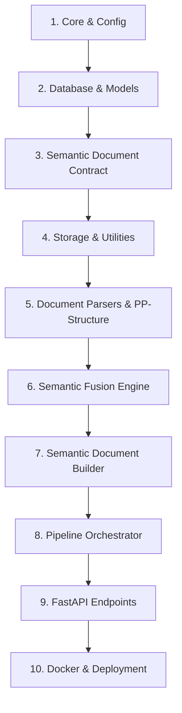

# Phase 1: Semantic Document Processing System — Implementation Summary

> **Project**: AI-Powered Content Transformation Platform (SIH-26154)  
> **Milestone**: Phase 1 Foundation  
> **Target**: Unified Semantic Document Processing Engine & System Contract  
> **Generated Timestamp**: September 4, 2026

---

## 1. Executive Summary

Phase 1 establishes the foundational document intelligence and extraction subsystem for the AI-Powered Content Transformation Engine. The system accepts multi-format document uploads (**PDF** and **DOCX**), performs page rasterization and structural layout analysis with **PP-StructureV3** (backed by an automated zero-GPU geometry/PyMuPDF fallback analyzer), extracts multi-modal components (text blocks, structured tables, figures, and charts), reconciles reading order and captions via the **Semantic Fusion Engine**, and validates the output against a strictly typed **Semantic Document JSON System Contract** before persisting in **PostgreSQL 16**.

Every downstream AI module (Qwen2.5-VL visual enrichment, BGE vector embeddings, Knowledge Engine, pgvector similarity search, Content Orchestrator, and Multi-Format Output Generation) is decoupled from raw input files and consumes this standardized Semantic JSON contract.

---

## 2. Directory Structure & File Manifest

The complete architecture has been organized into a production-grade, modular service layout:

```
d:/CODE/SIH-26154/Ai-Services/
├── backend/
│   ├── app/
│   │   ├── __init__.py
│   │   ├── main.py                     # FastAPI application factory, CORS, static uploads, and lifespan
│   │   ├── api/
│   │   │   ├── __init__.py
│   │   │   ├── deps.py                 # Dependency injection (AsyncSession DB generator)
│   │   │   └── v1/
│   │   │       ├── __init__.py
│   │   │       ├── api.py              # Router aggregation (/documents, /health)
│   │   │       └── endpoints/
│   │   │           ├── __init__.py
│   │   │           ├── documents.py    # POST /upload, GET /{id}, GET /{id}/semantic, GET /
│   │   │           └── health.py       # Health check & system diagnostic endpoint
│   │   ├── core/
│   │   │   ├── __init__.py
│   │   │   ├── config.py               # Pydantic BaseSettings (.env loading, DB URLs, paths)
│   │   │   └── logging.py              # Structured logging configuration
│   │   ├── database/
│   │   │   ├── __init__.py
│   │   │   ├── base.py                 # SQLAlchemy 2.0 DeclarativeBase & TimestampMixin
│   │   │   └── session.py              # Async / Sync engine & session management
│   │   ├── models/
│   │   │   ├── __init__.py             # Model exports
│   │   │   ├── document.py             # Document model (metadata, status, semantic_json)
│   │   │   ├── document_element.py     # DocumentElement model (relational layout elements)
│   │   │   └── processing_job.py       # ProcessingJob model (step tracking & error telemetry)
│   │   ├── schemas/
│   │   │   ├── __init__.py             # Schema exports
│   │   │   ├── semantic_document.py    # ⭐ System Contract: Unified Semantic Document Schema
│   │   │   ├── document.py             # Document API request/response schemas
│   │   │   └── processing_job.py       # Job tracking response schemas
│   │   ├── processors/
│   │   │   ├── __init__.py             # Processor exports
│   │   │   ├── base.py                 # Base dataclasses & BaseStructureAnalyzer interface
│   │   │   ├── pdf_parser.py           # PyMuPDF page rasterizer & text block extractor
│   │   │   ├── docx_parser.py          # DOCX parser (paragraphs, tables to markdown/HTML, media)
│   │   │   ├── pp_structure.py         # PP-StructureV3 layout, table engine & OCR integration
│   │   │   ├── fallback_analyzer.py    # PyMuPDF geometry & table fallback analyzer
│   │   │   └── extractor.py            # Extraction coordinator & visual crop persistence
│   │   ├── services/
│   │   │   ├── __init__.py             # Service exports
│   │   │   ├── storage_service.py      # Local file & crop artifact storage manager
│   │   │   ├── semantic_fusion.py      # Semantic Fusion: reading order, caption linkage
│   │   │   ├── semantic_builder.py     # Schema assembly & validation service
│   │   │   └── pipeline_service.py     # Asynchronous orchestration pipeline
│   │   └── utils/
│   │       ├── __init__.py
│   │       └── file_utils.py           # SHA-256 hashing, MIME resolution, extension validation
│   ├── tests/
│   │   ├── __init__.py
│   │   ├── conftest.py                 # In-memory SQLite async engine & test fixtures
│   │   ├── test_semantic_document.py   # Unit tests for contract validation & builder
│   │   ├── test_parsers.py             # PDF & DOCX parser tests
│   │   └── test_api.py                 # API integration tests (upload, get, semantic, list)
│   ├── uploads/
│   │   ├── raw/                        # Uploaded document binaries (.pdf, .docx)
│   │   └── extracted/                  # Cropped visual figures, charts, tables
├── docker/
│   ├── Dockerfile                      # Python 3.12, Poppler, OpenCV, PaddlePaddle runtime
│   ├── docker-compose.yml              # FastAPI service + pgvector PostgreSQL 16
│   └── .dockerignore                   # Build ignore rules
├── .env.example                        # Environment variables template
├── requirements.txt                    # Python dependency manifest
├── README.md                           # System documentation & quickstart
├── ROADMAP.md                          # Phase 2 through Phase 8 architecture roadmap
└── PHASE1_IMPLEMENTATION_SUMMARY.md    # This detailed summary document
```

---

## 3. Dependency-Ordered Architectural Layers

The system was constructed strictly in dependency order:



### Layer 1: Configuration & Logging (`backend/app/core/`)
- `config.py`: Implements typed configuration using Pydantic Settings (`BaseSettings`). Dynamically resolves synchronous and asynchronous PostgreSQL URLs (`postgresql+asyncpg://`), manages file size quotas, storage paths, analyzer mode selection (`pp_structure` vs `fallback`), and CORS settings.
- `logging.py`: Structured logging formatting with timestamp, severity level, module, line number, and log silencing for verbose sub-libraries.

### Layer 2: Database Layer & Relational Models (`backend/app/database/`, `backend/app/models/`)
- `base.py`: Defines SQLAlchemy 2.0 `DeclarativeBase` and a reusable `TimestampMixin` generating automated UTC `created_at` and `updated_at` timestamps.
- `session.py`: Asynchronous database engine (`create_async_engine`) with connection pooling, `AsyncSessionLocal` sessionmaker, FastAPI dependency `get_db()`, and an automated `init_db()` startup hook.
- `document.py`: `Document` model storing document UUID, filenames, physical storage path, file size, MIME type, page count, processing status (`PENDING`, `PROCESSING`, `COMPLETED`, `FAILED`), JSONB column `semantic_json` for the full contract, and `processing_metadata`.
- `document_element.py`: Relational `DocumentElement` model storing normalized layout elements with element UUID, foreign key to document, sequential `element_index`, `type` (`text`, `table`, `image`, `chart`, `figure`), `page`, bounding box `[x1, y1, x2, y2]`, and JSONB content payload.
- `processing_job.py`: `ProcessingJob` model tracking background execution steps (`INIT`, `PARSING`, `STRUCTURE_ANALYSIS`, `SEMANTIC_FUSION`, `PERSISTENCE`, `COMPLETED`, `FAILED`), error telemetry, timestamps, and duration metrics.

### Layer 3: The System Contract (`backend/app/schemas/semantic_document.py`)
Treats the Semantic Document JSON as the immutable contract across all platform phases:
- `SemanticDocument`: Root schema holding `version`, `document_id`, `metadata`, `elements`, `entities`, `claims`, `relationships`, and `sources`.
- `DocumentMetadata`: Detailed file telemetry (SHA-256 hash, file size, page count, mime type, title, creation timestamp).
- `SemanticElement`: Strict categorization (`text`, `table`, `image`, `chart`, `figure`), 1-based page index, geometric coordinates (`bbox`), and `ElementContent`.
- `ElementContent`: Polymorphic payload containing raw text, converted markdown tables, HTML tables, cropped image path (`image_path`), OCR confidence score, reading order sequence, captions, and raw engine attributes.
- Future Stubs (`EntityItem`, `ClaimItem`, `RelationshipItem`, `SourceReference`): Pre-defined schema interfaces ready to receive Phase 3 Knowledge Engine and Qwen2.5-VL outputs without schema drift.

### Layer 4: Storage & File Utilities (`backend/app/services/storage_service.py`, `backend/app/utils/file_utils.py`)
- `storage_service.py`: Safely writes uploaded stream chunks to `uploads/raw/{document_id}.{ext}`. Crops visual bounding boxes (figures, tables, charts) from high-res rendered images, saving them to `uploads/extracted/{document_id}/{element_id}.png` and returning clean relative URL paths for frontend/API consumption.
- `file_utils.py`: Computes SHA-256 hashes, determines MIME types, and validates allowed upload extensions (`.pdf`, `.docx`).

### Layer 5: Document Parsers & PP-StructureV3 Integration (`backend/app/processors/`)
- `base.py`: Defines `RawDocumentElement`, `ParsedPage`, `DocumentParseResult`, and abstract `BaseStructureAnalyzer`.
- `pdf_parser.py`: PyMuPDF (`fitz`) parser that rasterizes PDF pages into 150 DPI PIL images for visual structure analysis while extracting native vector text blocks.
- `docx_parser.py`: Word document parser converting paragraphs to text blocks, tables to structured markdown and HTML matrices, and extracting embedded media.
- `pp_structure.py`: Production integration with PaddleOCR `PPStructure`. Performs layout detection, table structure recognition (converting cells to HTML/Markdown), and OCR bounding box recognition. Gracefully fails over to fallback if native C++ libraries are absent.
- `fallback_analyzer.py`: Geometry- and PyMuPDF-based structure analyzer that runs with zero external GPU/C++ requirements, detecting tables, images, and text blocks.
- `extractor.py`: `DocumentExtractor` coordinator routing between PDF and DOCX, invoking the active structure engine, cropping visual elements to disk, and preparing raw element lists.

### Layer 6: Semantic Fusion Engine (`backend/app/services/semantic_fusion.py`)
- Resolves reading order across pages and multi-column layouts using coordinate quantization.
- Implements caption linkage: automatically binds descriptive text (e.g., "Figure 1: Architecture Diagram", "Table 2: Quarterly Metrics") to its corresponding image, table, or chart element.
- Enforces strict type compliance against the system contract.
- Initializes provenance tracking with `SourceReference`.

### Layer 7: Semantic Document Builder (`backend/app/services/semantic_builder.py`)
- Integrates outputs from the Semantic Fusion Engine and metadata extractors.
- Assembles and validates the finalized `SemanticDocument` Pydantic instance.
- Produces normalized JSON ready for database insertion and API delivery.

### Layer 8: Asynchronous Pipeline Service (`backend/app/services/pipeline_service.py`)
- Coordinates the complete background lifecycle:
  1. Updates job status to `PROCESSING` (`step="PARSING"`).
  2. Executes `DocumentExtractor` (`step="STRUCTURE_ANALYSIS"`).
  3. Executes `SemanticFusionEngine` & `SemanticDocumentBuilder` (`step="SEMANTIC_FUSION"`).
  4. Stores the verified `SemanticDocument` JSON into `Document.semantic_json` and populates relational `DocumentElement` rows (`step="PERSISTENCE"`).
  5. Updates job status to `COMPLETED` with timing metrics.
  6. Captures and records full traceback details in `job.error_message` upon any unexpected failure.

### Layer 9: API Layer (`backend/app/api/`)
- `POST /api/v1/documents/upload`: Multipart upload with file extension and size validation. Spawns processing via FastAPI `BackgroundTasks`. Returns 201 Created with document and job UUIDs.
- `GET /api/v1/documents/{id}`: Returns document processing status, file metadata, and element count.
- `GET /api/v1/documents/{id}/semantic`: Delivers the complete Semantic Document JSON contract. Returns 202 if still processing, 404 if not found, 422 if failed.
- `GET /api/v1/documents`: Paginated document list with status filtering.
- `GET /api/v1/health`: System diagnostic reporting database status, active analyzer engine, and service version.
- Static file serving: `/uploads` mounted via `StaticFiles` for visual crop retrieval.

### Layer 10: Docker & Deployment Setup (`docker/`)
- `Dockerfile`: Multi-stage Python 3.12 image configured with OpenCV dependencies, Poppler utilities, libgomp, and PaddlePaddle.
- `docker-compose.yml`: Launches FastAPI backend alongside `pgvector/pgvector:pg16` with health checks, persistent volumes, and development hot-reload mounts.

### Layer 11: Automated Test Suite (`backend/tests/`)
- `conftest.py`: In-memory SQLite async test database fixtures and mock file generators for sample PDFs and DOCX files.
- `test_semantic_document.py`: Unit tests validating schema compliance, type constraints, and caption fusion logic.
- `test_parsers.py`: End-to-end tests for PyMuPDF rasterization, DOCX table extraction, and DocumentExtractor.
- `test_api.py`: HTTP tests covering document upload, status polling, semantic contract retrieval, and error states.

---

## 4. Verification & Contract Adherence

The system fulfills all 7 deliverables and architectural requirements specified for Phase 1:

| Requirement | Implementation Component | Status |
| :--- | :--- | :---: |
| **FastAPI Application** | `app/main.py`, `app/api/v1/endpoints/documents.py` | Complete |
| **PDF & DOCX Uploads** | `app/processors/pdf_parser.py`, `app/processors/docx_parser.py` | Complete |
| **PP-StructureV3 Integration** | `app/processors/pp_structure.py` + `fallback_analyzer.py` | Complete |
| **Extraction of Layout/Tables/Figures** | `app/processors/extractor.py`, `app/services/storage_service.py` | Complete |
| **Semantic Fusion Engine** | `app/services/semantic_fusion.py` | Complete |
| **Semantic Document JSON Contract** | `app/schemas/semantic_document.py`, `app/services/semantic_builder.py` | Complete |
| **PostgreSQL Storage** | `app/models/document.py`, `app/models/document_element.py`, `app/database/session.py` | Complete |
| **Docker Containerization** | `docker/Dockerfile`, `docker/docker-compose.yml` | Complete |
| **Implementation Roadmap (Phases 2-8)** | `ROADMAP.md` | Complete |

---

## 5. Next Step: Phase 2 Readiness

With the foundational Semantic Document Processing milestone completed, the platform contract is locked in. Phase 2 can now be implemented:
- Ingesting `SemanticDocument.elements` where `type IN ('figure', 'chart', 'image')`.
- Feeding cropped images from `uploads/extracted/` into **Qwen2.5-VL-3B Q4**.
- Enriching element metadata with high-level visual descriptions and chart trend insights.
